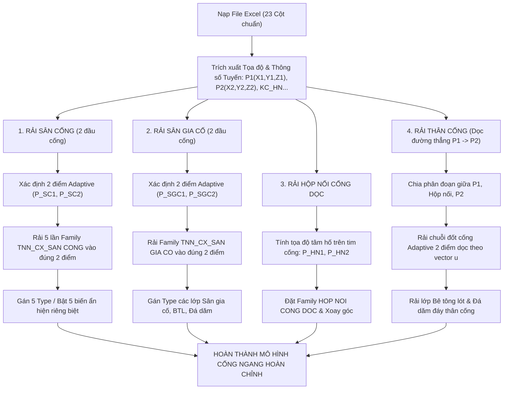

# PHƯƠNG ÁN THUẬT TOÁN RẢI CỐNG NGANG TỰ ĐỘNG BẰNG ADAPTIVE COMPONENT
*Dự án: DV_TOOL_HTKT - Phiên bản 2025*
*Ngày lập: 05/10/2026*

---

## I. TỔNG QUAN PHÂN TÍCH TỪ HỆ FAMILY & YÊU CẦU NGƯỜI DÙNG

Dựa trên 3 hình ảnh anh cung cấp từ Revit Family Editor và các tệp Family RFA trong dự án:

```
                  HỆ THỐNG CẤU KIỆN CỐNG NGANG (DV_TOOL_HTKT)
┌─────────────────────────────────────────────────────────────────────────────┐
│ 1. SÂN CỐNG (CỬA XẢ)     : TNN_CX_SAN CONG.rfa   (Adaptive 2 Points)        │
│    -> Tích hợp 5 bộ phận : Tường đầu | Tường cánh | Sân cống | BTL | Đá dăm │
│ 2. SÂN GIA CỐ            : TNN_CX_SAN GIA CO.rfa (Adaptive 2 Points)        │
│    -> Tích hợp 3 bộ phận : Sân gia cố đá hộc | BTL | Đá dăm                 │
│ 3. THÂN CỐNG             : TNN_CH_THAN CONG.rfa  (Adaptive 2 Points)        │
│    -> Đốt cống điển hình : Rải dọc theo đường thẳng nối P1 -> P2            │
│ 4. HỘP NỐI CỐNG DỌC      : HOP NOI CONG DOC.rfa  (1 Điểm tọa độ tâm)        │
│ 5. LÓT & ĐỆM ĐÁ DĂM ĐÁY  : TNN_CH_BE TONG LOT.rfa, TNN_CH_DA DAM DEM.rfa    │
└─────────────────────────────────────────────────────────────────────────────┘
```

---

## II. CHI TIẾT THUẬT TOÁN RẢI TỪNG CẤU KIỆN

### 1. Cấu kiện Sân Cống (Hình 1 - `TNN_CX_SAN CONG.rfa`)
- **Đặc tính kỹ thuật:** 
  - Là **Generic Model Adaptive** có **2 điểm Adaptive Points** ($P_{SC1}$ và $P_{SC2}$).
  - Điểm 1 ($P_{SC1}$): Nằm tại vị trí tim đầu cống liên kết với tường đầu.
  - Điểm 2 ($P_{SC2}$): Nằm tại mép ngoài sân cống theo trục tim tuyến xả.
  - Chứa 5 bộ phận hình học liên kết với nhau, được điều khiển bởi 5 biến hiển thị (Visibility Parameters) hoặc 5 Family Types:
    1. `TNN_CX_TUONG DAU` (Bật tường đầu + bê tông lót & móng đá dăm tường đầu)
    2. `TNN_CX_TUONG CANH` (Bật tường cánh)
    3. `TNN_CX_SAN CONG` (Bật bản bê tông sân cống)
    4. `TNN_CX_BE TONG LOT` (Bật bản bê tông lót sân cống)
    5. `TNN_CX_DA DAM DEM` (Bật lớp đệm đá dăm sân cống)
- **Thuật toán rải (Ma trận 5 lần cùng tọa độ):**
  1. Xác định chính xác tọa độ 3D của 2 điểm $P_{SC1}(X, Y, Z)$ và $P_{SC2}(X, Y, Z)$ tại đầu Thượng lưu (và Hạ lưu).
  2. Tạo 1 vòng lặp `for (int i = 0; i < 5; i++)`:
     - Gọi API Revit: `AdaptiveComponentInstanceUtils.CreateAdaptiveComponentInstance(doc, symbol_i)`
     - Lấy 2 Placement Points của instance vừa tạo.
     - Gán:
       $$\text{Point}_1.\text{Position} = P_{SC1}$$
       $$\text{Point}_2.\text{Position} = P_{SC2}$$
     - Gán tương ứng Type thứ $i$ (hoặc bật đúng biến Yes/No của bộ phận thứ $i$, 4 biến còn lại tắt = No).
  3. **Kết quả:** Tại đúng 1 vị trí sân cống, xuất hiện đủ 5 đối tượng cấu kiện độc lập, khớp chính xác hình học và vật liệu, bóc tách khối lượng (Take-off) riêng rẽ cho từng hạng mục mà không bị chồng lấn hình học (overlap void/solid).

---

### 2. Cấu kiện Sân Gia Cố (Hình 2 - `TNN_CX_SAN GIA CO.rfa`)
- **Đặc tính kỹ thuật:**
  - Là **Adaptive Family 2 Points** ($P_{SGC1}$ và $P_{SGC2}$).
  - Điểm 1 ($P_{SGC1}$): Nối tiếp ngay sau mép ngoài của Sân cống ($P_{SC2}$).
  - Điểm 2 ($P_{SGC2}$): Điểm chân khay / mép ngoài cùng của sân gia cố.
  - Có tham số báo cáo `CH_SGC_L1 (report)` tự động bắt chiều dài giữa 2 điểm.
  - Chứa các lớp vật liệu:
    1. `TNN_CX_SGC_SAN GIA CO` (Đá hộc xây vữa)
    2. `TNN_CX_SGC_BE TONG LOT` (Bê tông lót)
    3. Lớp đá dăm đệm
- **Thuật toán rải:**
  - Rải tương tự Sân cống: Đặt các instances vào đúng cặp tọa độ $(P_{SGC1}, P_{SGC2})$ và gán Type/ẩn hiện cho từng lớp.

---

### 3. Cấu kiện Thân Cống (Hình 3 - `TNN_CH_THAN CONG.rfa`)
- **Đặc tính kỹ thuật:**
  - Là **Adaptive Family 2 Points** ($P_{TC1}$ và $P_{TC2}$).
  - Điểm 1 và Điểm 2 nằm dọc theo trục tim đốt cống, khoảng cách giữa 2 điểm chính là chiều dài đốt cống $L_{\text{đốt}}$ (ví dụ: 1.0m).
- **Thuật toán rải dọc đường thẳng tim cống:**
  1. Trục tim tuyến được định nghĩa bởi vector đơn vị $\vec{u}$:
     $$\vec{u} = \frac{P_2 - P_1}{\|P_2 - P_1\|}$$
  2. Xác định các khoảng ngắt do Hộp nối cống dọc:
     - Tuyến cống từ $P_1 \to P_2$ được chia thành các phân đoạn thân cống:
       - Phân đoạn 1: Từ $P_1$ đến Hộp nối 1 (khoảng cách $KC\_HN1$)
       - Phân đoạn 2: Từ Hộp nối 1 đến Hộp nối 2
       - Phân đoạn 3: Từ Hộp nối 2 đến $P_2$
  3. Trên mỗi phân đoạn có chiều dài $L_{\text{seg}}$:
     - Số đốt cống tiêu chuẩn: $N = \lfloor L_{\text{seg}} / L_{\text{đốt}} \rfloor$
     - Chiều dài đốt bù cuối cùng: $L_{\text{bù}} = L_{\text{seg}} - N \cdot L_{\text{đốt}}$
     - Vòng lặp rải từng đốt cống:
       $$\text{Point}_1 = P_{\text{start}} + k \cdot L_{\text{đốt}} \cdot \vec{u}$$
       $$\text{Point}_2 = P_{\text{start}} + (k + 1) \cdot L_{\text{đốt}} \cdot \vec{u}$$
     - Đặt instance Adaptive của thân cống vào 2 điểm $(\text{Point}_1, \text{Point}_2)$.
     - Đốt cống sẽ tự động xoay và kéo dài chuẩn xác 100% theo đúng độ dốc và góc xoay thực tế trong không gian 3D.

---

### 4. Cấu kiện Hộp Nối Cống Dọc (`HOP NOI CONG DOC.rfa`)
- **Đặc tính kỹ thuật:**
  - Family đặt theo điểm (Point-based hoặc Work-plane based).
- **Thuật toán rải:**
  1. Tọa độ tâm hộp nối thứ $j$ trên trục tim:
     $$P_{HN, j} = P_1 + \text{Dist}_{HN, j} \cdot \vec{u}$$
  2. Cao độ đáy hộp nối: tính toán nội suy theo độ dốc tim cống từ $Z_1$ và $Z_2$.
  3. Đặt FamilyInstance tại tọa độ $P_{HN, j}$ và xoay quanh trục Z theo góc Azimuth của tim cống.

---

## III. SƠ ĐỒ QUY TRÌNH TỔNG THỂ (MERMAID)



---

## IV. CÁC NỘI DUNG CẦN ANH THỐNG NHẤT ("CHỐT")

Trước khi bắt tay vào cập nhật mã nguồn Add-in, em kính chuyển anh xem xét và làm rõ 3 điểm sau:

1. **Về dữ liệu tọa độ Sân cống trong Excel:**
   - **Cách 1:** File Excel sẽ có thêm các cột tọa độ cụ thể của 2 điểm Sân cống (ví dụ: $X_{SC1}, Y_{SC1}, Z_{SC1}$ và $X_{SC2}, Y_{SC2}, Z_{SC2}$)?
   - **Cách 2:** Hay Add-in sẽ tự động tính ra 2 điểm Adaptive của Sân cống dựa vào $P_1, P_2$, chiều dài sân cống và góc mở của cửa xả?
2. **Về việc gán ẩn hiện 5 bộ phận Sân cống:**
   - Anh muốn Add-in rải 5 lần và **tự động gán luôn 5 Type tương ứng** (`TNN_CX_TUONG DAU`, `TNN_CX_TUONG CANH`, `TNN_CX_SAN CONG`, `TNN_CX_BE TONG LOT`, `TNN_CX_DA DAM DEM`) để hoàn thiện ngay lập tức, hay anh muốn rải 5 instance cùng Type rồi anh tự chọn thủ công trong Revit?
3. **Về chiều dài đốt thân cống:**
   - Chiều dài mỗi đốt cống đúc sẵn điển hình hiện tại của Family trong dự án là cố định **1.0m** (1000mm) hay bao nhiêu để thuật toán chia đốt chuẩn nhất?
